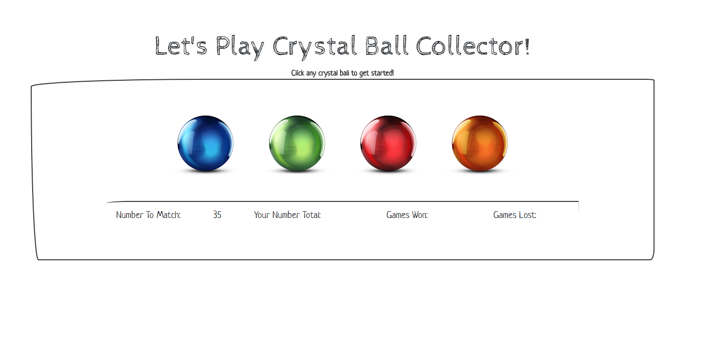

# CRYSTAL BALL COLLECTOR

### The player will have to guess the answer, just like in Hangman. This time, though, the player will guess with numbers instead of letters. Here's how the app works:

* There will be four crystals displayed as buttons on the page.

* You will be shown a random number at the start of the game.

* When you click on a crystal, it will add a specific amount of points to your total score. 

* The game will hide this amount until the you click on a crystal.

* When you do click one, the score counter will be updated.

* You will win if your total score matches the random number from the beginning of the game.

* You will lose if your score goes above the random number.

* The game restarts whenever you win or lose.

* When the game begins again, you should see a new random number. Also, all the crystals will have four new hidden values. Of course, your score (and score counter) will reset to zero.

* The app should show the number of games you have won and lost. To that end, do not refresh the page as a means to restart the game.

## GitHub Repo: https://lablancaponder.github.io/CrystalCollector/

## Screenshot

## Languages/Libraries used:

* Javascript
* JQUERY

